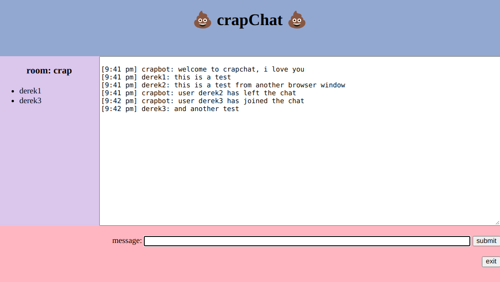

# websocket real-time chat example with node, sockets.io and express

basic node websocket chat interface with express & sockets.io.

this is based a number of online tutorials, see `References` section.



## features and todo

- (todo) refactor the user leaving and adding code, don't like the list approach
- (todo) fix the craptastic layout
- (todo) dockerize

## requirements

- `npm` and `node`

## start

```
# install necessary packages
npm install

# run with nodemon
npm start
```

## usage/testing

by default, it runs on port 5000. navigate to `http://localhost:5000` (or server addr if running remotely)

## references

based primarily on:

[Realtime Chat With Users & Rooms - Socket.io, Node & Express](https://www.youtube.com/watch?v=jD7FnbI76Hg)  